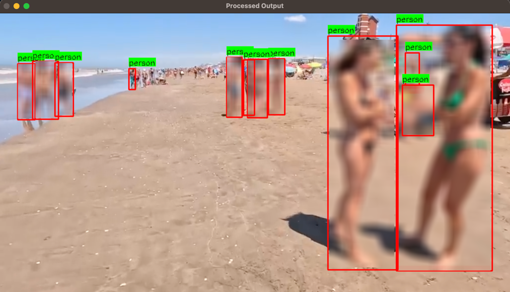

# Person Detection with Automatic Nudity and Indecent Dressing Blurring
This project implements a system for detecting people in video and image frames, checking for inappropriate
dressing (nudity), and applying blurring to detected regions where nudity
is identified. It utilizes the YOLOv8 model for person detection and a separate YOLOv8 model for nudity detection. The system is capable of processing video files and image files and outputting processed videos/image with identified nudity regions blurred for privacy.
The system supports both video and image processing. please don't forget to leave a star⭐️ on the GitHub repo.




## Table of Contents

- [Applications](#Applications)
- [Features](#features)
- [Installation](#installation)
- [Usage](#usage)
  - [Video Processing](#video-processing)
  - [Image Processing](#image-processing)
- [Dependencies](#dependencies)
- [Project Structure](#project-structure)
- [License](#license)

## Applications

- ✅ Content Moderation on Social Media Platforms
- ✅  Kids' Educational Content
- ✅  Child-Friendly Online Platforms
- ✅  Real-time Automated Content Filtering for Streaming Services
- ✅  Video Surveillance Systems
- ✅  Live Streaming Platforms
- ✅  Educational and Training Videos
- ✅ Video Archiving and Compliance
- ✅ Public Event Footage
- ✅  Healthcare and Medical Imaging
- ✅ Virtual Reality (VR) Content
- ✅  Workplace Monitoring Systems

## Features

- Detects people in video frames and images using a pre-trained YOLOv8 model.
- Identifies nudity in detected people using a second pre-trained YOLOv8 nudity model.
- Applies blurring to regions of detected nudity.
- Outputs processed videos and images with identified nudity regions blurred.
- Customizable confidence thresholds for both person and nudity detection.
- Adjustable blur intensity for nudity regions.

- Certainly! Here’s the updated list including applications for children:


## Installation

1. **Clone the Repository:**

   ```bash
   git clone https://github.com/your-username/your-repo-name.git
   cd your-repo-name
   ```

2. **Install Required Python Packages:**

   Install the required Python packages using pip:

   ```bash
   pip install -r requirements.txt
   ```

   Make sure the following packages are installed:
   - `ultralytics`
   - `opencv-python`
   - `numpy`

3. **Download YOLOv8 Models:**

   Download and place the YOLOv8 person detection model and the nudity detection model in the project directory. Update the paths in the code accordingly.

   - Person detection model (e.g., `yolov8s.pt`)
   - Nudity detection model (e.g., `N_300 (1).pt`)

## Usage

### Video Processing

1. **Prepare Your Video File:**

   Ensure you have the video file you want to process. Place it in the project directory or specify the path to it.

2. **Run the Video Processing Script:**

   Execute the following command:

   ```bash
   python video_processor.py
   ```

   Update `video_path` and `output_file_name` in the `run()` method of the `PersonAttireProcessor` class to specify your input and output files.

### Image Processing

1. **Prepare Your Image File:**

   Ensure you have the image file you want to process. Place it in the project directory or specify the path to it.

2. **Run the Image Processing Script:**

   Execute the following command:

   ```bash
   python image_processor.py
   ```

   Update `image_file` in the `process_image()` method of the `ImageProcessor` class to specify your input image file.

## Dependencies

- `ultralytics`: For YOLOv8 model handling.
- `opencv-python`: For video and image processing.
- `numpy`: For numerical operations.

Install dependencies using:

```bash
pip install ultralytics opencv-python numpy
```

## Project Structure

```
.
|-- video_processor.py       # Script for processing videos
|-- image_processor.py       # Script for processing images
|-- yolov8s.pt              # YOLOv8 person detection model (download and add to project)
|-- N_300 (1).pt            # YOLOv8 nudity detection model (download and add to project)
|-- Untitled.mp4            # Sample input video (replace with your own video file)
|-- Untitledout.mp4         # Processed output video (output after running the video script)
|-- img_8.png               # Sample input image (replace with your own image file)
|-- README.md               # Project README file
```

## License

This project is licensed under the MIT License. See the [LICENSE](LICENSE) file for more information.

## Contact

If you have any questions or suggestions, feel free to contact me at danielsamueletukudo@gmail.com and on linkedin@ https://www.linkedin.com/in/daniel-etukudo
